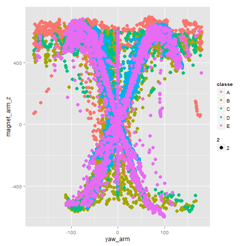

Coursera PML Project
========================================================

This project focuses on building a Machine Learning model of user activity performance using multiple accelerometer measurements. I explain my thought process using machine learning concepts.

The purpose of this model is to correctly classify new observations.


## Loading and Cleaning Data


```r
options(warn=-1)

dataset <- read.table('data/pml-training.csv', 
                      sep = ',', 
                      header = TRUE, 
                      stringsAsFactors = FALSE, 
                      na.strings = c('','NA','#DIV/0!'))

# Table of Complete (No NA Values) vs Incomplete Rows (At least 1 NA Value)
table(complete.cases(dataset))
```

```
## 
## FALSE 
## 19622
```

```r
# Number of Columns with X% of NA Values
colNAs <- colSums(is.na(dataset))
percents<- table(colNAs/nrow(dataset))
percentNames <- round(as.numeric(names(percents))*100,2)
percentNames <- paste0(percentNames,'%')
names(percents) <- percentNames
percents
```

```
##     0% 97.93% 97.94% 97.94% 97.95% 97.96% 97.98% 97.98% 97.99% 98.09% 
##     60     67      1      1      1      4      1      4      2      2 
## 98.32% 98.33% 98.34% 98.35% 98.36% 98.36%   100% 
##      1      1      2      1      4      2      6
```

The previous tables show no complete observations highly influenced by columns composed almost entirely of NA. Data imputation is ruled out for these columns.


```r
dataset <- dataset[colNAs == 0]

nonMeasures <- 1:7
dataset <- dataset[-nonMeasures]
dataset$classe <- factor(dataset$classe)
```

Tree models will be used for this classification problem. Features such as timestamp, user and window are useless and might cause bias and should be removed.

**NOTE: Exercises were performed sequentially, so a timestamp or index (factor) value would bias the model.**

Final dataset has 52 numeric covariates, 1 factor target and 0 NA values. **No further pre process is required. Transformation of variables with tree models has little to no effect.**

## Split Data

I chose a 60%/20%/20% split for training, testing and validation sets. Training to create the model; Testing to select a model with best accuracy; Validation to estimate the Out of Sample Error.


```r
set.seed(1961927)
inValidate <- createDataPartition(dataset$classe, p = 0.2, list = FALSE)

validation <- dataset[inValidate,]
dataset <- dataset[-inValidate,]

inTrain <- createDataPartition(dataset$classe, p = 0.75, list = FALSE)
training <- dataset[inTrain,]
testing <- dataset[-inTrain,]
```

## Exploratory Data Analysis

All scatterplots of Xi vs Xj with classe as color were analyzed. All presented complex behaviors. 1326 plots were generated. I present only one of such plots.

 

The plot shows incorrect performances around the correct ones.

 

The heatmap on scaled data is difficult to read entirely and several columns appear as noise. However, multiple subgroups means there are observable differences and behaviors between samples and columns which a tree can take advantage of.

## Tree Models Selected

I have chosen to use tree models listed below. 
* CART (`rpart`)
* RandomForest (`rf`)
* Bagging Trees (`treebag`)
* Gradient Boosting Machine (`gbm`)
* Combined Estimation of All (Vote Mode)

If I combine multiple models this way I should use an odd number of models. Worst case scenario however is that each model gets a different answer out of 5 possible. I should properly use at least 7 models. Computational limitations restrict me to 4. This should help avoid worst case scenario.

## Cross Validation (CV)

Data is sorted by `classe` so K-Fold CV is not recommened because it would only study a handful of classes. Possible choices fall upon LOOCV and boot.

LOOCV is computationally intensive and boot can underestimate the error. We can adjust the latter with boot-632 and the validation set.


```r
#controlTrain <- trainControl(method = 'boot632', number = 25)
controlTrain <- trainControl(method = 'boot632', number = 15)
#controlTrain <- trainControl(method = 'repeatedcv', number=10, repeats=2)
```

Compute all models with training data.


```r
modelCRT <- train(classe ~ . , training, method = 'rpart', 
                  trControl = controlTrain)

#Faster RF execution, parallel multi thread
#cl <- makePSOCKcluster(4)
#clusterEvalQ(cl, library(foreach))
#registerDoParallel(cl)
modelRFS <- train(classe ~ . , training, method = 'rf', 
                  trControl = controlTrain)
#closeAllConnections()

modelBTS <- train(classe ~ . , training, method = 'treebag', 
                  trControl = controlTrain)

#GBM Uses a lot of RAM (Breaking Execution, reduced it's tuning parameters)
gbmGrid <-  expand.grid(n.trees = c(150), 
                        shrinkage=c(0.1),
                        interaction.depth=c(5))
modelGBM <- train(classe ~ . , training, method = 'gbm', verbose = FALSE,
                  trControl = controlTrain, tuneGrid = gbmGrid)

models <- list(CRT = modelCRT,
               RFS = modelRFS,
               BTS = modelBTS,
               GBM = modelGBM)
```

Model combination uses a custom mode function.


```r
voteFN <- function(predictions){
  #predictions <- do.call(cbind, predictions)
  return(apply(predictions, 1, modeFN))
}

modeFN <- function(values){
  temp <- table(values)
  return(names(temp)[which.max(temp)])
}
```

Predictions are compute for each model over training, testing and validation sets.


```r
#Training
trainPred <- data.frame(real = training$classe)
trainPred$CRT <- predict(modelCRT, newdata = training)
trainPred$RFS <- predict(modelRFS, newdata = training)
trainPred$BTS <- predict(modelBTS, newdata = training)
trainPred$GBM <- predict(modelGBM, newdata = training)
trainPred$ALL <- voteFN(trainPred[-1])

#Testing
testPred <- data.frame(real = testing$classe)
testPred$CRT <- predict(modelCRT, newdata = testing)
testPred$RFS <- predict(modelRFS, newdata = testing)
testPred$BTS <- predict(modelBTS, newdata = testing)
testPred$GBM <- predict(modelGBM, newdata = testing)
testPred$ALL <- voteFN(testPred[-1])

#Validation
validPred <- data.frame(real = validation$classe)
validPred$CRT <- predict(modelCRT, newdata = validation)
validPred$RFS <- predict(modelRFS, newdata = validation)
validPred$BTS <- predict(modelBTS, newdata = validation)
validPred$GBM <- predict(modelGBM, newdata = validation)
validPred$ALL <- voteFN(validPred[-1])
```

I use a custom accuracy evaluation.


```r
MyAccuracy <- function(preds){
  realValues <- preds[,1]
  output <- sapply(preds[-1], function(x) x == realValues)
  return(colSums(output)/nrow(preds))
}
```

I select the best model out of accuracy in testing set.


```r
trainAcc <- MyAccuracy(trainPred)
testAcc  <- MyAccuracy(testPred)
validAcc <- MyAccuracy(validPred)

#Find Maximum Accuracy Model on Testing Data
bestModelPos <- which.max(testAcc)
bestModelName <- names(testAcc)[bestModelPos]

#Error Estimation
AccuracyALL <- data.frame(training = trainAcc, 
                          testing = testAcc, 
                          validation = validAcc)

#Accuracy for Best Model in Train / Test / Validation
AccuracyALL[bestModelPos,]
```

```
##     training testing validation
## RFS        1  0.9916     0.9924
```

```r
# Confusion Matrix of Best Model vs Real Test Classe
confusionMatrix(data = testPred[, bestModelPos + 1], 
                reference = testing$classe)$table
```

```
##           Reference
## Prediction    A    B    C    D    E
##          A 1114    7    0    0    0
##          B    0  751    1    2    0
##          C    1    1  680   13    1
##          D    0    0    3  627    2
##          E    1    0    0    1  718
```

Best model was RFS which showed good results even taking into account that overfitting was high during training. It did well on testing and validation.

**Another model might seem more effective overall, but given Machine Learning concepts we can't change the model by considering the validation set "part of the training or selection".**

 

I expected the ALL model to be better. It could be that CART or some other model affected it. For future reference, CART might be a bad choice for model combination with other more efficient models.

## Coursera Test
**I expect the error rate on the Coursera 20 Values assigment to be closely similar to what I observed in my validation set, since it is a similar scenario and I obtained a near 100% accuracy on prediction.**


I proceed to load the Coursera testing data.


```r
courseraTest <- read.table('data/pml-testing.csv',
                           sep = ',', 
                           header = TRUE, 
                           stringsAsFactors = FALSE, 
                           na.strings = c('','NA','#DIV/0!'))
if(bestModelName == 'ALL'){
  projectAnswers <- lapply(models, function(x) predict(x, courseraTest))
  projectAnswers <- do.call(cbind.data.frame, projectAnswers)
  projectAnswers <- voteFN(projectAnswers)
}else{
  projectAnswers <- predict(models[[bestModelName]], courseraTest)
  projectAnswers <- as.character(projectAnswers)
}


pml_write_files(projectAnswers)
```

## Conclusions

I can't compute the error for the Coursera Test set. I can only trust my work and model usage to behave similarly (although possible above or below it) as it did with the validation set (but the value should be lower than with the training set).

## Improvements

* Change boot-632 with Stratified K Fold Cross Validation.

* Explore more modeling options or machine learning algorithms, other tree ensembles or modified versions of the ones used in this document.
